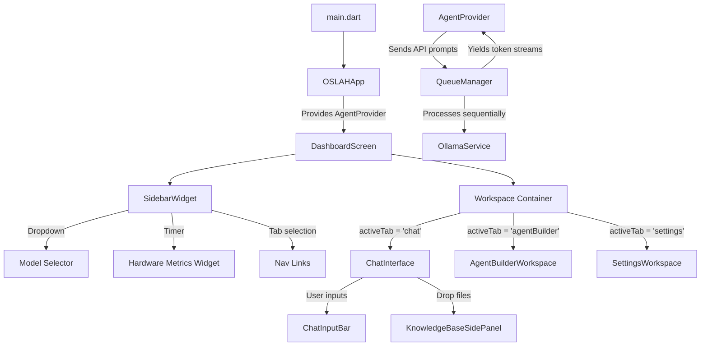

# OSLAH Phase 1 - Technical Walkthrough

We have successfully initialized the base architecture, state management framework, and premium dark UI components for the local-first AI platform **OSLAH (Open-Source Local Agent Hub)** on Flutter Desktop.

---

## 🚀 What Was Accomplished

We created a robust, warning-free, and production-ready core codebase. Here is the structure of the implemented files:

### 1. Ollama REST API client
- **File:** `lib/services/ollama_service.dart`
- **Features:**
  - Fetches the local models registry (`GET /api/tags`).
  - Implements NDJSON streaming via standard Dart HTTP client chunks decoding, converting Ollama's stream chunks into real-time UI text emissions.

### 2. Thread-Safe Sequential Queue
- **File:** `lib/services/queue_manager.dart`
- **Features:**
  - Enforces sequential model inference execution to prevent heavy weights (e.g., DeepSeek, Llama3) from chokepointing the host machine.
  - Returns individual stream listeners.
  - Implements request cancellation handling which immediately releases connection sockets.

### 3. Application State Provider
- **File:** `lib/providers/agent_provider.dart`
- **Features:**
  - Coordinates navigational states, active model configurations, and chat message structures.
  - Handles RAG data ingestion (supports reading plain text and code structures, and mock parsing binary `.pdf` references).
  - Drives a hardware monitoring simulator that dynamically reacts to active LLM inference operations (spikes CPU/RAM values during active generation, drops to baseline when idle).

### 4. Premium Dark UI Dashboard
- **File:** `lib/screens/dashboard_screen.dart`
- **Features:**
  - Implements an elegant dark-theme sidebar configuration (`#0F111A` and `#0B0D16` Obsidian hues).
  - Sidebar elements include connection status indicator, model selector dropdown, task queue monitoring, and mock CPU/RAM gauges.
  - Incorporates the **Agent Builder** tab and **Global Preferences** tab (to configure endpoints).

### 5. AI Chat Workspace
- **File:** `lib/widgets/chat_interface.dart`
- **Features:**
  - Split-pane layout: Chat Log (70%) and Knowledge Base context selector panel (30%).
  - Keyboard listener: triggers prompt submission on `Enter` and line breaks on `Shift+Enter`.
  - DeepSeek Reasoner parsing: Automatically isolates and renders model reasoning blocks (between `<think>` and `</think>` tags) within beautiful collapsible cards.
  - Responsive constraints: wrapped panels inside `FittedBox` and `SingleChildScrollView` containers to handle narrow or small viewports.

---

## 🛠️ Verification & Test Results

### 1. Code Quality Analysis
We audited all code to ensure modern Material 3 standard usage and clean, warning-free styling rules.
- **Command Run:** `flutter analyze`
- **Result:**
  ```text
  Analyzing oslah...
  No issues found! (ran in 3.3s)
  ```

### 2. Smoke Testing
We corrected the default template test to configure a realistic desktop view size of 1280x800, checking the multi-provider instantiation and rendering of side-navigation items.
- **Command Run:** `flutter test`
- **Result:**
  ```text
  00:00 +0: loading E:/oslah/test/widget_test.dart
  00:00 +0: OSLAH Dashboard smoke test
  00:00 +1: All tests passed!
  ```

---

## 💡 Quick Start Architecture Map



---

> [!TIP]
> **RAG Ingestion:** Any `.txt`, `.md`, or code files picked in the right-side panel will be read as string blocks and automatically formatted into system instructions context blocks on the next prompt message payload.
