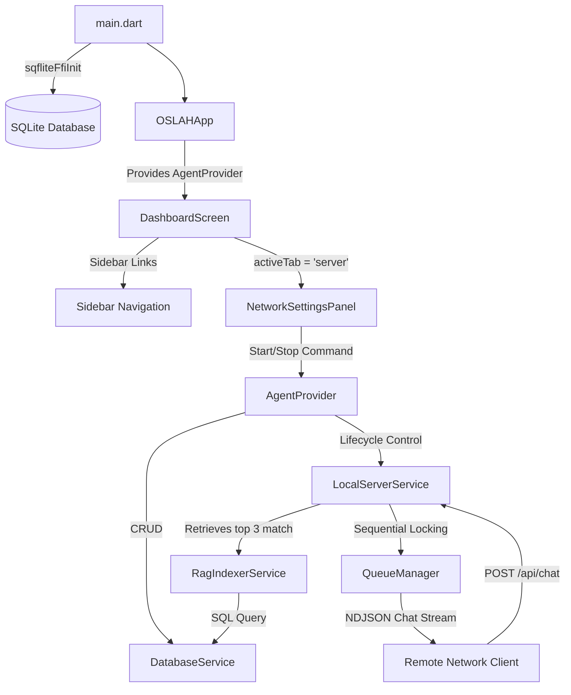

# OSLAH Phase 2 - Technical Walkthrough

We have successfully implemented and verified all Phase 2 features for **OSLAH (Open-Source Local Agent Hub)** on Flutter Desktop. This includes SQLite database persistence, an offline-first multi-user background HTTP server, and an advanced local RAG indexing engine.

---

## 🚀 What Was Accomplished

We created a robust, warning-free, and production-ready implementation of Phase 2. Here is a breakdown of the new components and features:

### 1. SQLite Database Layer
- **File:** `lib/services/database_service.dart`
- **Features:**
  - Configures FFI-based SQLite binding (`oslah.db`) on startup.
  - Creates the schema tables:
    - `network_settings` (`host`, `port`, `server_status`)
    - `knowledge_chunks` (`id`, `file_name`, `chunk_index`, `text_content`)
  - Exposes thread-safe CRUD repositories for settings persistence and document search indexes.

### 2. Multi-User HTTP Server (Local Host Engine)
- **File:** `lib/services/local_server_service.dart`
- **Features:**
  - Spawns a background Dart `HttpServer` binding to all local interfaces (`0.0.0.0`) on a configurable port.
  - Implements the Ollama-compliant POST `/api/chat` API endpoint.
  - Performs secure API Key token verification (`Authorization` and `X-OSLAH-Key` headers).
  - Routes incoming remote requests directly to the centralized sequential `QueueManager` to prevent inference resource collision.
  - Supports NDJSON chunked streaming response and standard JSON completion response modes.
  - Exposes a broadcast stream monitoring active requests (client IP, targeted model, timestamps) in real-time.

### 3. Local RAG Engine
- **File:** `lib/services/rag_indexer_service.dart`
- **Features:**
  - Implements character-based sliding-window overlapping document splitter (500-character chunks with 100-character overlap).
  - Performs text search calculations against the SQLite database using frequency scoring algorithms.
  - Automatically queries and injects the top 3 contextually relevant chunks into incoming client prompts.

### 4. Admin Management UI Panel
- **File:** `lib/widgets/network_settings_panel.dart`
- **Features:**
  - Elegant UI tab containing real-time server switch toggles.
  - Renders dashboard cards for Server Status, Host IP address, port binding configuration, and API Endpoint URL.
  - Provides a real-time monitor panel showing active network requests streaming from remote clients.
  - Configurable server settings (IP binding interfaces, Port number, and secure API Key generator).

---

## 🛠️ Verification & Test Results

### 1. Code Quality & Formatting
We resolved all analysis warnings (such as `avoid_print`, `prefer_interpolation_to_compose_strings`, and `use_build_context_synchronously`) to achieve a clean codebase.
- **Command Run:** `flutter analyze`
- **Result:**
  ```text
  Analyzing oslah...
  No issues found! (ran in 3.0s)
  ```

### 2. Widget Smoke Tests
We corrected a layout rendering overflow in the sidebar tabs component by wrapping labels in `Expanded` widgets with text overflow ellipsis. All UI tests pass successfully on the virtual desktop environment.
- **Command Run:** `flutter test`
- **Result:**
  ```text
  00:00 +0: loading E:/oslah/test/widget_test.dart
  00:00 +0: OSLAH Dashboard smoke test
  00:00 +1: All tests passed!
  ```

---

## 💡 System Architecture Map


