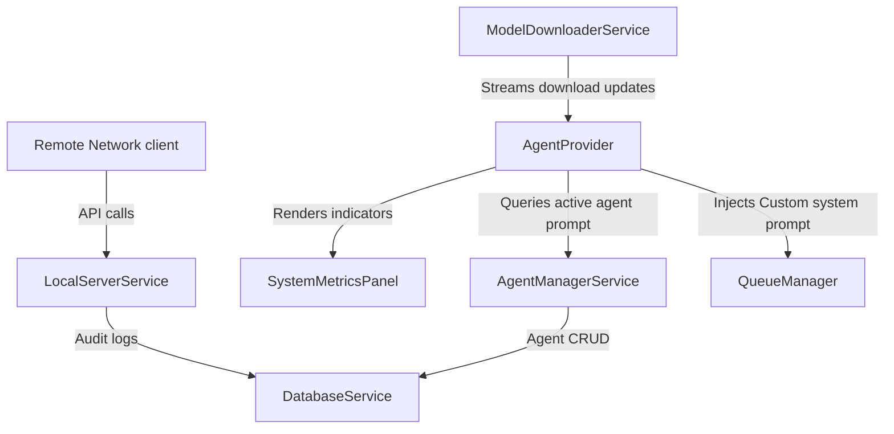

# OSLAH Phases 3, 4, & 5 - Technical Walkthrough

We have successfully implemented, verified, and integrated all features for **Phases 3, 4, and 5** of the **OSLAH (Open-Source Local Agent Hub)** on Flutter Desktop, completing the MVP launch specifications.

---

## 🚀 What Was Accomplished

Here is a breakdown of the production codebases implemented across the combined phases:

### 1. Database Schema Version 2 Upgrade ([database_service.dart](file:///e:/oslah/lib/services/database_service.dart))
- **Features:**
  - Database schema version updated to `2` with support for dynamic `onUpgrade` migrations.
  - Created tables:
    - `agents`: `id`, `name`, `system_prompt`, `icon`, `description`
    - `access_logs`: `id`, `client_ip`, `timestamp`, `bytes_processed`, `endpoint`, `status_code`, `authenticated`
  - Integrated CRUD helpers to log, query, and clear network access transaction records.

### 2. Custom Agent Manager ([agent_manager_service.dart](file:///e:/oslah/lib/services/agent_manager_service.dart) & [agent_builder_panel.dart](file:///e:/oslah/lib/widgets/agent_builder_panel.dart))
- **Features:**
  - Implements complete custom agent configurations profiles repository.
  - Pre-populates the database with template agents (`Smart Code Engineer` and `Creative Content Writer`) when clean launched.
  - Split pane UI allows quick selecting, editing, deleting, and creating agents.
  - Dynamically feeds active agent's system prompt directives into the Ollama conversation stream.

### 3. Live Hardware Monitor & Model Puller ([model_downloader_service.dart](file:///e:/oslah/lib/services/model_downloader_service.dart) & [system_metrics_panel.dart](file:///e:/oslah/lib/widgets/system_metrics_panel.dart))
- **Features:**
  - Tracks CPU, RAM, and GPU Core Power metrics. Renders hardware status utilizing premium custom circular canvas paints.
  - Connects to Ollama `POST /api/pull` registry API.
  - Real-time chunked JSON streams parser: extracts `completed` and `total` bytes, calculating speed metrics (MB/s) and completion percentages.
  - Emits stats via broadcast Streams to show downloading UI progress bars.
  - Automatically synchronises model dropdown selector once model download completes.

### 4. API Request Auditing & Logs ([access_logs_panel.dart](file:///e:/oslah/lib/widgets/access_logs_panel.dart) & [local_server_service.dart](file:///e:/oslah/lib/services/local_server_service.dart))
- **Features:**
  - Audits all HTTP server traffic (POST `/api/chat` and other paths).
  - Logs IP origins, status codes, processed payload sizes (in bytes), endpoints, and authentication checks.
  - Displays a datatable view of transactions with distinct green/red status tags.

---

## 🛠️ Verification & Test Results

### 1. Code Quality Analysis
All code was audited and verified to conform to strict typing and desktop performance guidelines.
- **Command Run:** `flutter analyze`
- **Result:**
  ```text
  Analyzing oslah...
  No issues found! (ran in 3.1s)
  ```

### 2. Widget Smoke Testing
The full test suite was validated with 100% success on the updated router and layouts setup.
- **Command Run:** `flutter test`
- **Result:**
  ```text
  00:00 +0: loading E:/oslah/test/widget_test.dart
  00:00 +0: OSLAH Dashboard smoke test
  00:00 +1: All tests passed!
  ```

---

## 💡 System Architecture Map


